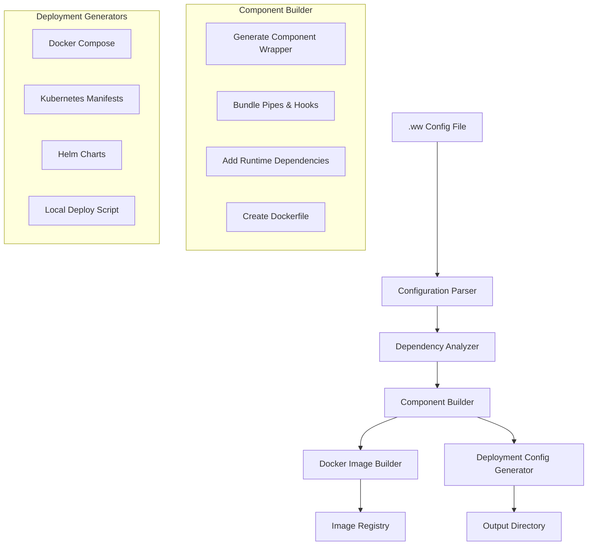

# Technical Design: Build System (`woodwork build`)

## Overview

This document defines the technical implementation for the `woodwork build` command that analyzes .ww configuration files and generates production-ready Docker containers, deployment configurations, and local deployment capabilities. The build system serves as the bridge between declarative .ww configurations and containerized microservices deployment.

## Requirements

### Functional Requirements
- **FR1**: Parse .ww configuration files and extract component definitions
- **FR2**: Generate optimized Dockerfiles for each component with bundled pipes
- **FR3**: Create deployment configurations (docker-compose, Kubernetes, Helm)
- **FR4**: Support local deployment with `--deploy local` flag
- **FR5**: Build and tag Docker images for each component
- **FR6**: Include streaming handlers, metrics emitters, and event system integration
- **FR7**: Support multiple optimization targets (development, production)
- **FR8**: Generate deployment metadata for future cloud deployment features

### Non-Functional Requirements
- **NFR1**: Build completion in <30 seconds for typical projects
- **NFR2**: Generated containers optimized for <100MB size when possible
- **NFR3**: Support incremental builds and caching
- **NFR4**: Generated configurations compatible with standard orchestration tools
- **NFR5**: Robust error handling with actionable error messages

## Architecture

### Build Pipeline Overview



### Core Components

1. **Configuration Parser**: Parses .ww files into structured component definitions
2. **Dependency Analyzer**: Resolves component dependencies and data flow
3. **Component Builder**: Generates component wrappers and bundles dependencies
4. **Docker Builder**: Creates and builds Docker images for each component
5. **Deployment Generators**: Create deployment configurations for various platforms
6. **Local Deployer**: Handles `--deploy local` functionality

## Detailed Design

### 1. Build Command Interface

```python
# woodwork/commands/build.py
import click
import asyncio
import logging
from pathlib import Path
from typing import Dict, List, Optional, Any
from woodwork.core.build_system import BuildOrchestrator, BuildConfig

log = logging.getLogger(__name__)

@click.command()
@click.option('--config', '-c', default='main.ww', help='Configuration file to build')
@click.option('--output', '-o', default='./build', help='Output directory for build artifacts')
@click.option('--optimize-for', default='production', 
              type=click.Choice(['development', 'production', 'size']),
              help='Optimization target')
@click.option('--export', type=click.Choice(['docker-compose', 'kubernetes', 'helm']),
              help='Export only specific deployment format')
@click.option('--deploy', type=click.Choice(['local']),
              help='Deploy immediately after build')
@click.option('--detach', '-d', is_flag=True, help='Run deployment in background')
@click.option('--no-cache', is_flag=True, help='Disable build cache')
@click.option('--parallel', '-j', default=4, help='Number of parallel build jobs')
@click.option('--registry', help='Docker registry to push images to')
@click.option('--namespace', help='Kubernetes namespace for deployment')
@click.option('--values', help='Helm values file for template generation')
@click.option('--dry-run', is_flag=True, help='Show what would be built without executing')
def build(
    config: str,
    output: str,
    optimize_for: str,
    export: Optional[str],
    deploy: Optional[str],
    detach: bool,
    no_cache: bool,
    parallel: int,
    registry: Optional[str],
    namespace: Optional[str],
    values: Optional[str],
    dry_run: bool
):
    """Build Woodwork components into containerized deployments"""
    
    try:
        # Create build configuration
        build_config = BuildConfig(
            config_file=config,
            output_dir=output,
            optimization_target=optimize_for,
            export_format=export,
            deploy_target=deploy,
            detach_deployment=detach,
            use_cache=not no_cache,
            parallel_jobs=parallel,
            docker_registry=registry,
            kubernetes_namespace=namespace,
            helm_values_file=values,
            dry_run=dry_run
        )
        
        # Create and run build orchestrator
        orchestrator = BuildOrchestrator(build_config)
        
        if dry_run:
            click.echo("🔍 Dry run mode - showing build plan...")
            plan = orchestrator.generate_build_plan()
            orchestrator.display_build_plan(plan)
        else:
            click.echo(f"🔨 Building {config} -> {output}")
            asyncio.run(orchestrator.build())
            
    except Exception as e:
        click.echo(f"❌ Build failed: {e}", err=True)
        raise click.ClickException(str(e))
```

### 2. Build Configuration

```python
# woodwork/core/build_system/config.py
from dataclasses import dataclass, field
from typing import Optional, Dict, Any, List
from pathlib import Path

@dataclass
class BuildConfig:
    """Configuration for build process"""
    config_file: str
    output_dir: str
    optimization_target: str = 'production'
    export_format: Optional[str] = None
    deploy_target: Optional[str] = None
    detach_deployment: bool = False
    use_cache: bool = True
    parallel_jobs: int = 4
    docker_registry: Optional[str] = None
    kubernetes_namespace: Optional[str] = None
    helm_values_file: Optional[str] = None
    dry_run: bool = False
    
    # Build optimization settings
    python_version: str = '3.11'
    base_image: str = 'python:3.11-slim'
    woodwork_version: str = 'latest'
    
    # Generated paths
    output_path: Path = field(init=False)
    build_cache_path: Path = field(init=False)
    
    def __post_init__(self):
        self.output_path = Path(self.output_dir).resolve()
        self.build_cache_path = self.output_path / '.build-cache'

@dataclass
class ComponentBuildSpec:
    """Build specification for a single component"""
    name: str
    component_type: str
    config: Dict[str, Any]
    pipes: List[str] = field(default_factory=list)
    hooks: List[str] = field(default_factory=list)
    dependencies: List[str] = field(default_factory=list)
    resource_requirements: Dict[str, Any] = field(default_factory=dict)
    deployment_config: Dict[str, Any] = field(default_factory=dict)
    
    # Build outputs
    dockerfile_path: Optional[Path] = None
    image_name: Optional[str] = None
    build_context_path: Optional[Path] = None

@dataclass
class BuildPlan:
    """Complete build plan for all components"""
    components: List[ComponentBuildSpec]
    message_bus_config: Dict[str, Any]
    deployment_configs: Dict[str, Any]
    build_order: List[str]  # Dependency-sorted build order
    estimated_build_time: float
    total_components: int
```

### 3. Build Orchestrator

```python
# woodwork/core/build_system/orchestrator.py
import asyncio
import docker
import json
import shutil
import time
from pathlib import Path
from typing import Dict, List, Any, Optional
from woodwork.core.build_system.config import BuildConfig, BuildPlan, ComponentBuildSpec
from woodwork.core.build_system.parsers import ConfigurationParser
from woodwork.core.build_system.generators import (
    DockerfileGenerator, 
    DockerComposeGenerator,
    KubernetesGenerator,
    HelmGenerator,
    ComponentWrapperGenerator
)
from woodwork.core.build_system.deployers import LocalDeployer

class BuildOrchestrator:
    """Orchestrates the entire build process"""
    
    def __init__(self, config: BuildConfig):
        self.config = config
        self.docker_client = docker.from_env()
        
        # Initialize generators
        self.dockerfile_generator = DockerfileGenerator(config)
        self.wrapper_generator = ComponentWrapperGenerator(config)
        self.compose_generator = DockerComposeGenerator(config)
        self.k8s_generator = KubernetesGenerator(config)
        self.helm_generator = HelmGenerator(config)
        
        # Initialize deployer for local deployment
        self.local_deployer = LocalDeployer(config)
        
    async def build(self) -> Dict[str, Any]:
        """Execute complete build process"""
        
        start_time = time.time()
        
        try:
            # 1. Parse configuration
            log.info("📋 Parsing configuration...")
            build_plan = await self.parse_configuration()
            
            # 2. Prepare build environment
            log.info("🏗️ Preparing build environment...")
            await self.prepare_build_environment()
            
            # 3. Generate component artifacts
            log.info("⚙️ Generating component artifacts...")
            await self.generate_component_artifacts(build_plan)
            
            # 4. Build Docker images
            if not self.config.export_format:  # Only build images if not just exporting configs
                log.info("🐳 Building Docker images...")
                await self.build_docker_images(build_plan)
            
            # 5. Generate deployment configurations
            log.info("📦 Generating deployment configurations...")
            await self.generate_deployment_configs(build_plan)
            
            # 6. Deploy locally if requested
            if self.config.deploy_target == 'local':
                log.info("🚀 Deploying locally...")
                await self.deploy_local(build_plan)
            
            build_time = time.time() - start_time
            
            # 7. Generate build summary
            summary = self.generate_build_summary(build_plan, build_time)
            self.display_build_summary(summary)
            
            return summary
            
        except Exception as e:
            log.error(f"Build failed: {e}")
            raise
    
    async def parse_configuration(self) -> BuildPlan:
        """Parse .ww configuration file and create build plan"""
        
        parser = ConfigurationParser(self.config)
        components = await parser.parse_components(self.config.config_file)
        
        # Analyze dependencies and determine build order
        build_order = self._calculate_build_order(components)
        
        # Estimate build time
        estimated_time = self._estimate_build_time(components)
        
        return BuildPlan(
            components=components,
            message_bus_config=parser.message_bus_config,
            deployment_configs=parser.deployment_configs,
            build_order=build_order,
            estimated_build_time=estimated_time,
            total_components=len(components)
        )
    
    async def prepare_build_environment(self):
        """Prepare build directories and cache"""
        
        # Create output directories
        self.config.output_path.mkdir(parents=True, exist_ok=True)
        (self.config.output_path / 'components').mkdir(exist_ok=True)
        (self.config.output_path / 'deployments').mkdir(exist_ok=True)
        
        # Create cache directory
        if self.config.use_cache:
            self.config.build_cache_path.mkdir(exist_ok=True)
        
        # Create deployment metadata directory
        (self.config.output_path / '.woodwork-deploy').mkdir(exist_ok=True)
    
    async def generate_component_artifacts(self, build_plan: BuildPlan):
        """Generate all component artifacts (wrappers, Dockerfiles, etc.)"""
        
        # Use semaphore to limit concurrent operations
        semaphore = asyncio.Semaphore(self.config.parallel_jobs)
        
        async def generate_single_component(component: ComponentBuildSpec):
            async with semaphore:
                await self._generate_component_artifacts(component)
        
        # Generate all components in parallel
        tasks = [
            generate_single_component(component) 
            for component in build_plan.components
        ]
        await asyncio.gather(*tasks)
    
    async def _generate_component_artifacts(self, component: ComponentBuildSpec):
        """Generate artifacts for single component"""
        
        component_dir = self.config.output_path / 'components' / component.name
        component_dir.mkdir(exist_ok=True)
        
        # 1. Generate component wrapper
        wrapper_code = await self.wrapper_generator.generate_wrapper(component)
        wrapper_file = component_dir / 'component.py'
        wrapper_file.write_text(wrapper_code)
        
        # 2. Copy and bundle pipes
        pipes_dir = component_dir / 'pipes'
        pipes_dir.mkdir(exist_ok=True)
        await self._bundle_pipes(component, pipes_dir)
        
        # 3. Generate streaming handler
        streaming_handler = await self.wrapper_generator.generate_streaming_handler(component)
        (component_dir / 'streaming_handler.py').write_text(streaming_handler)
        
        # 4. Generate metrics emitter
        metrics_emitter = await self.wrapper_generator.generate_metrics_emitter(component)
        (component_dir / 'metrics_emitter.py').write_text(metrics_emitter)
        
        # 5. Generate requirements.txt
        requirements = await self._generate_requirements(component)
        (component_dir / 'requirements.txt').write_text(requirements)
        
        # 6. Generate Dockerfile
        dockerfile = await self.dockerfile_generator.generate_dockerfile(component)
        (component_dir / 'Dockerfile').write_text(dockerfile)
        
        # Update component build spec
        component.dockerfile_path = component_dir / 'Dockerfile'
        component.build_context_path = component_dir
        component.image_name = f"woodwork-{component.name}:{self.config.woodwork_version}"
    
    async def _bundle_pipes(self, component: ComponentBuildSpec, pipes_dir: Path):
        """Bundle pipe functions with component"""
        
        for pipe_ref in component.pipes:
            # Parse pipe reference (e.g., "pipes.py::function_name")
            if '::' in pipe_ref:
                file_path, function_name = pipe_ref.split('::', 1)
                
                # Copy pipe file
                source_file = Path(file_path)
                if source_file.exists():
                    dest_file = pipes_dir / source_file.name
                    shutil.copy2(source_file, dest_file)
                    
                    # Create pipe wrapper if needed
                    wrapper = self._generate_pipe_wrapper(function_name, source_file.name)
                    (pipes_dir / f"{function_name}_wrapper.py").write_text(wrapper)
    
    def _generate_pipe_wrapper(self, function_name: str, module_name: str) -> str:
        """Generate wrapper for pipe function"""
        module_stem = Path(module_name).stem
        
        return f'''
# Generated pipe wrapper for {function_name}
import importlib.util
import os
from pathlib import Path

def load_{function_name}():
    """Load pipe function dynamically"""
    current_dir = Path(__file__).parent
    module_path = current_dir / "{module_name}"
    
    spec = importlib.util.spec_from_file_location("{module_stem}", module_path)
    module = importlib.util.module_from_spec(spec)
    spec.loader.exec_module(module)
    
    return getattr(module, "{function_name}")

# Export the function
{function_name} = load_{function_name}()
'''
    
    async def build_docker_images(self, build_plan: BuildPlan):
        """Build Docker images for all components"""
        
        semaphore = asyncio.Semaphore(self.config.parallel_jobs)
        
        async def build_single_image(component: ComponentBuildSpec):
            async with semaphore:
                await self._build_component_image(component)
        
        # Build images according to dependency order
        for component_name in build_plan.build_order:
            component = next(c for c in build_plan.components if c.name == component_name)
            await build_single_image(component)
    
    async def _build_component_image(self, component: ComponentBuildSpec):
        """Build Docker image for single component"""
        
        try:
            # Check cache first
            if self.config.use_cache and self._is_cached(component):
                log.info(f"✅ Using cached image for {component.name}")
                return
            
            log.info(f"🔨 Building image for {component.name}...")
            
            # Build image
            image, build_logs = self.docker_client.images.build(
                path=str(component.build_context_path),
                tag=component.image_name,
                rm=True,
                forcerm=True,
                pull=True
            )
            
            # Log build output in debug mode
            for log_entry in build_logs:
                if 'stream' in log_entry:
                    log.debug(log_entry['stream'].strip())
            
            log.info(f"✅ Built {component.image_name}")
            
            # Update cache
            if self.config.use_cache:
                self._update_cache(component)
            
        except docker.errors.BuildError as e:
            log.error(f"Failed to build {component.name}: {e}")
            raise
    
    async def generate_deployment_configs(self, build_plan: BuildPlan):
        """Generate deployment configurations for various platforms"""
        
        deployments_dir = self.config.output_path / 'deployments'
        
        # Generate based on export format or all formats
        if self.config.export_format == 'docker-compose' or not self.config.export_format:
            compose_config = await self.compose_generator.generate(build_plan)
            (deployments_dir / 'docker-compose.yml').write_text(compose_config)
            
        if self.config.export_format == 'kubernetes' or not self.config.export_format:
            k8s_manifests = await self.k8s_generator.generate(build_plan)
            k8s_dir = deployments_dir / 'kubernetes'
            k8s_dir.mkdir(exist_ok=True)
            
            for filename, content in k8s_manifests.items():
                (k8s_dir / filename).write_text(content)
                
        if self.config.export_format == 'helm' or not self.config.export_format:
            helm_chart = await self.helm_generator.generate(build_plan)
            helm_dir = deployments_dir / 'helm-chart'
            helm_dir.mkdir(exist_ok=True)
            
            for filename, content in helm_chart.items():
                file_path = helm_dir / filename
                file_path.parent.mkdir(parents=True, exist_ok=True)
                file_path.write_text(content)
        
        # Generate deployment metadata for future cloud features
        metadata = {
            "build_config": {
                "optimization_target": self.config.optimization_target,
                "woodwork_version": self.config.woodwork_version,
                "build_timestamp": time.time()
            },
            "components": [
                {
                    "name": comp.name,
                    "type": comp.component_type,
                    "image": comp.image_name,
                    "resource_requirements": comp.resource_requirements
                }
                for comp in build_plan.components
            ],
            "message_bus": build_plan.message_bus_config
        }
        
        metadata_file = self.config.output_path / '.woodwork-deploy' / 'deployment-config.json'
        metadata_file.write_text(json.dumps(metadata, indent=2))
    
    async def deploy_local(self, build_plan: BuildPlan):
        """Deploy locally using docker-compose"""
        
        compose_file = self.config.output_path / 'deployments' / 'docker-compose.yml'
        
        if not compose_file.exists():
            raise FileNotFoundError("docker-compose.yml not found. Run build without --export first.")
        
        await self.local_deployer.deploy(compose_file, self.config.detach_deployment)
    
    def _calculate_build_order(self, components: List[ComponentBuildSpec]) -> List[str]:
        """Calculate build order based on dependencies"""
        
        # Simple topological sort
        # In real implementation, would handle complex dependency graphs
        order = []
        remaining = {comp.name: comp for comp in components}
        
        while remaining:
            # Find components with no unresolved dependencies
            ready = [
                name for name, comp in remaining.items()
                if all(dep in order or dep not in remaining for dep in comp.dependencies)
            ]
            
            if not ready:
                # Handle circular dependencies
                ready = [list(remaining.keys())[0]]
            
            order.extend(ready)
            for name in ready:
                del remaining[name]
                
        return order
    
    def _estimate_build_time(self, components: List[ComponentBuildSpec]) -> float:
        """Estimate total build time"""
        
        # Simple estimation based on component types
        base_time_per_component = 30  # seconds
        type_multipliers = {
            'llm': 1.5,      # LLM components take longer
            'agent': 1.3,    # Agent components are complex
            'input': 0.8,    # Simple components are faster
            'output': 0.8
        }
        
        total_time = 0
        for component in components:
            multiplier = type_multipliers.get(component.component_type, 1.0)
            total_time += base_time_per_component * multiplier
            
        # Account for parallel builds
        if self.config.parallel_jobs > 1:
            total_time /= min(self.config.parallel_jobs, len(components))
            
        return total_time
    
    def _is_cached(self, component: ComponentBuildSpec) -> bool:
        """Check if component image is cached and up-to-date"""
        
        if not self.config.use_cache:
            return False
            
        cache_file = self.config.build_cache_path / f"{component.name}.cache"
        if not cache_file.exists():
            return False
            
        try:
            cache_data = json.loads(cache_file.read_text())
            
            # Check if source files have changed
            last_build = cache_data.get('last_build', 0)
            source_files = [
                component.dockerfile_path,
                component.build_context_path / 'component.py',
                component.build_context_path / 'requirements.txt'
            ]
            
            for file_path in source_files:
                if file_path and file_path.exists():
                    if file_path.stat().st_mtime > last_build:
                        return False
                        
            return True
            
        except Exception:
            return False
    
    def _update_cache(self, component: ComponentBuildSpec):
        """Update build cache for component"""
        
        cache_data = {
            'last_build': time.time(),
            'image_name': component.image_name,
            'component_hash': self._calculate_component_hash(component)
        }
        
        cache_file = self.config.build_cache_path / f"{component.name}.cache"
        cache_file.write_text(json.dumps(cache_data))
    
    def _calculate_component_hash(self, component: ComponentBuildSpec) -> str:
        """Calculate hash of component for cache invalidation"""
        import hashlib
        
        hasher = hashlib.sha256()
        
        # Hash component config
        hasher.update(json.dumps(component.config, sort_keys=True).encode())
        
        # Hash pipe and hook references
        hasher.update(json.dumps(component.pipes, sort_keys=True).encode())
        hasher.update(json.dumps(component.hooks, sort_keys=True).encode())
        
        return hasher.hexdigest()[:16]
    
    def generate_build_summary(self, build_plan: BuildPlan, build_time: float) -> Dict[str, Any]:
        """Generate build summary"""
        
        return {
            "status": "success",
            "build_time": build_time,
            "components_built": build_plan.total_components,
            "output_directory": str(self.config.output_path),
            "optimization_target": self.config.optimization_target,
            "deployment_formats": self._get_generated_formats(),
            "images": [comp.image_name for comp in build_plan.components if comp.image_name],
            "local_deployment": self.config.deploy_target == 'local'
        }
    
    def _get_generated_formats(self) -> List[str]:
        """Get list of generated deployment formats"""
        formats = []
        deployments_dir = self.config.output_path / 'deployments'
        
        if (deployments_dir / 'docker-compose.yml').exists():
            formats.append('docker-compose')
        if (deployments_dir / 'kubernetes').exists():
            formats.append('kubernetes')
        if (deployments_dir / 'helm-chart').exists():
            formats.append('helm')
            
        return formats
    
    def display_build_summary(self, summary: Dict[str, Any]):
        """Display build summary to user"""
        
        print(f"")
        print(f"✅ Build completed successfully!")
        print(f"📦 Built {summary['components_built']} components in {summary['build_time']:.1f}s")
        print(f"📁 Output directory: {summary['output_directory']}")
        print(f"🎯 Optimization: {summary['optimization_target']}")
        
        if summary['images']:
            print(f"🐳 Docker images:")
            for image in summary['images']:
                print(f"   - {image}")
        
        if summary['deployment_formats']:
            print(f"📋 Generated deployment configs:")
            for fmt in summary['deployment_formats']:
                print(f"   - {fmt}")
        
        if summary['local_deployment']:
            print(f"🚀 Local deployment started")
            print(f"   Use 'woodwork logs' to view logs")
            print(f"   Use 'woodwork stop' to stop services")
    
    def generate_build_plan(self) -> BuildPlan:
        """Generate build plan for dry-run mode"""
        return asyncio.run(self.parse_configuration())
    
    def display_build_plan(self, build_plan: BuildPlan):
        """Display build plan for dry-run mode"""
        
        print(f"📋 Build Plan")
        print(f"━━━━━━━━━━━━━━━━━━━━━━━━━━━━━━━━━━━━━━━━")
        print(f"Configuration: {self.config.config_file}")
        print(f"Components: {build_plan.total_components}")
        print(f"Estimated build time: {build_plan.estimated_build_time:.1f}s")
        print(f"Build order: {' → '.join(build_plan.build_order)}")
        print(f"")
        
        for component in build_plan.components:
            print(f"📦 {component.name} ({component.component_type})")
            print(f"   Pipes: {len(component.pipes)}")
            print(f"   Hooks: {len(component.hooks)}")
            print(f"   Dependencies: {component.dependencies}")
            print(f"")
```

### 4. Dockerfile Generator

```python
# woodwork/core/build_system/generators/dockerfile.py
from woodwork.core.build_system.config import BuildConfig, ComponentBuildSpec

class DockerfileGenerator:
    """Generates optimized Dockerfiles for components"""
    
    def __init__(self, config: BuildConfig):
        self.config = config
    
    async def generate_dockerfile(self, component: ComponentBuildSpec) -> str:
        """Generate Dockerfile for component"""
        
        if self.config.optimization_target == 'development':
            return self._generate_dev_dockerfile(component)
        elif self.config.optimization_target == 'size':
            return self._generate_size_optimized_dockerfile(component)
        else:
            return self._generate_production_dockerfile(component)
    
    def _generate_production_dockerfile(self, component: ComponentBuildSpec) -> str:
        """Generate production-optimized Dockerfile"""
        
        # Determine resource requirements
        memory_limit = component.resource_requirements.get('memory', '1Gi')
        cpu_limit = component.resource_requirements.get('cpu', '500m')
        
        # Generate Dockerfile content
        dockerfile = f'''# Generated Dockerfile for {component.name} component
# Optimization target: {self.config.optimization_target}

FROM {self.config.base_image}

# Set environment variables
ENV PYTHONUNBUFFERED=1
ENV PYTHONDONTWRITEBYTECODE=1
ENV WOODWORK_COMPONENT_NAME={component.name}
ENV WOODWORK_COMPONENT_TYPE={component.component_type}

# Create non-root user for security
RUN groupadd -r woodwork && useradd -r -g woodwork woodwork

# Install system dependencies
RUN apt-get update && apt-get install -y --no-install-recommends \\
    curl \\
    ca-certificates \\
    && rm -rf /var/lib/apt/lists/*

# Set working directory
WORKDIR /app

# Copy requirements first for better caching
COPY requirements.txt .

# Install Python dependencies
RUN pip install --no-cache-dir -r requirements.txt

# Install woodwork runtime
RUN pip install --no-cache-dir woodwork-runtime=={self.config.woodwork_version}

# Copy component code
COPY component.py streaming_handler.py metrics_emitter.py ./
COPY pipes/ ./pipes/

# Set ownership
RUN chown -R woodwork:woodwork /app

# Switch to non-root user
USER woodwork

# Health check
HEALTHCHECK --interval=30s --timeout=10s --start-period=5s --retries=3 \\
    CMD curl -f http://localhost:8080/health || exit 1

# Expose component port
EXPOSE 8080

# Run component
CMD ["python", "component.py"]
'''
        
        return dockerfile
    
    def _generate_dev_dockerfile(self, component: ComponentBuildSpec) -> str:
        """Generate development-friendly Dockerfile with debugging tools"""
        
        dockerfile = f'''# Development Dockerfile for {component.name} component
FROM {self.config.base_image}

# Development environment variables
ENV PYTHONUNBUFFERED=1
ENV PYTHONDONTWRITEBYTECODE=1
ENV WOODWORK_COMPONENT_NAME={component.name}
ENV WOODWORK_COMPONENT_TYPE={component.component_type}
ENV WOODWORK_DEBUG=1

# Install development tools
RUN apt-get update && apt-get install -y --no-install-recommends \\
    curl \\
    ca-certificates \\
    iputils-ping \\
    net-tools \\
    procps \\
    vim \\
    && rm -rf /var/lib/apt/lists/*

WORKDIR /app

# Copy requirements
COPY requirements.txt .

# Install dependencies with debug symbols
RUN pip install --no-cache-dir -r requirements.txt
RUN pip install --no-cache-dir \\
    woodwork-runtime=={self.config.woodwork_version} \\
    ipdb \\
    pytest

# Copy source code
COPY component.py streaming_handler.py metrics_emitter.py ./
COPY pipes/ ./pipes/

# Simple health check
HEALTHCHECK --interval=30s --timeout=5s --retries=3 \\
    CMD curl -f http://localhost:8080/health || exit 1

EXPOSE 8080

# Development startup with auto-reload
CMD ["python", "-u", "component.py"]
'''
        
        return dockerfile
    
    def _generate_size_optimized_dockerfile(self, component: ComponentBuildSpec) -> str:
        """Generate size-optimized Dockerfile using multi-stage build"""
        
        dockerfile = f'''# Size-optimized Dockerfile for {component.name} component
FROM {self.config.base_image} as builder

# Build environment
ENV PYTHONUNBUFFERED=1
ENV PYTHONDONTWRITEBYTECODE=1

WORKDIR /build

# Copy requirements
COPY requirements.txt .

# Install dependencies to temporary location
RUN pip install --no-cache-dir --user -r requirements.txt
RUN pip install --no-cache-dir --user woodwork-runtime=={self.config.woodwork_version}

# Final stage - minimal image
FROM python:3.11-alpine

# Runtime environment variables
ENV PYTHONUNBUFFERED=1
ENV PYTHONDONTWRITEBYTECODE=1
ENV WOODWORK_COMPONENT_NAME={component.name}
ENV WOODWORK_COMPONENT_TYPE={component.component_type}
ENV PATH="/home/woodwork/.local/bin:$PATH"

# Create user
RUN addgroup -g 1000 woodwork && adduser -D -s /bin/sh -u 1000 -G woodwork woodwork

# Install minimal runtime dependencies
RUN apk add --no-cache curl

# Copy Python packages from builder
COPY --from=builder /root/.local /home/woodwork/.local

WORKDIR /app

# Copy component code
COPY --chown=woodwork:woodwork component.py streaming_handler.py metrics_emitter.py ./
COPY --chown=woodwork:woodwork pipes/ ./pipes/

USER woodwork

# Minimal health check
HEALTHCHECK --interval=30s --timeout=5s --retries=3 \\
    CMD curl -f http://localhost:8080/health || exit 1

EXPOSE 8080

CMD ["python", "component.py"]
'''
        
        return dockerfile
```

### 5. Local Deployer

```python
# woodwork/core/build_system/deployers/local.py
import asyncio
import docker
import yaml
from pathlib import Path
from typing import Dict, Any
from woodwork.core.build_system.config import BuildConfig

class LocalDeployer:
    """Handles local deployment using docker-compose"""
    
    def __init__(self, config: BuildConfig):
        self.config = config
        self.docker_client = docker.from_env()
        
    async def deploy(self, compose_file: Path, detach: bool = False):
        """Deploy using docker-compose"""
        
        try:
            # Validate compose file
            await self._validate_compose_file(compose_file)
            
            # Stop any existing deployment
            await self._stop_existing_deployment(compose_file)
            
            # Start services
            cmd = [
                'docker-compose',
                '-f', str(compose_file),
                'up'
            ]
            
            if detach:
                cmd.append('-d')
                
            # Execute docker-compose
            process = await asyncio.create_subprocess_exec(
                *cmd,
                cwd=compose_file.parent,
                stdout=asyncio.subprocess.PIPE,
                stderr=asyncio.subprocess.PIPE
            )
            
            if detach:
                # For detached mode, wait for startup and return
                stdout, stderr = await process.communicate()
                
                if process.returncode == 0:
                    print("✅ Services started successfully")
                    print("📋 Use 'woodwork logs' to view logs")
                    print("🛑 Use 'woodwork stop' to stop services")
                else:
                    print(f"❌ Deployment failed: {stderr.decode()}")
                    raise Exception(f"docker-compose failed: {stderr.decode()}")
                    
            else:
                # For attached mode, stream output
                print("🚀 Starting services...")
                await self._stream_logs(process)
                
        except Exception as e:
            raise Exception(f"Local deployment failed: {e}")
    
    async def _validate_compose_file(self, compose_file: Path):
        """Validate docker-compose file"""
        
        if not compose_file.exists():
            raise FileNotFoundError(f"Compose file not found: {compose_file}")
            
        try:
            with open(compose_file) as f:
                yaml.safe_load(f)
        except yaml.YAMLError as e:
            raise Exception(f"Invalid compose file: {e}")
    
    async def _stop_existing_deployment(self, compose_file: Path):
        """Stop any existing deployment"""
        
        try:
            cmd = [
                'docker-compose',
                '-f', str(compose_file),
                'down',
                '--remove-orphans'
            ]
            
            process = await asyncio.create_subprocess_exec(
                *cmd,
                cwd=compose_file.parent,
                stdout=asyncio.subprocess.DEVNULL,
                stderr=asyncio.subprocess.DEVNULL
            )
            
            await process.communicate()
            
        except Exception:
            pass  # Ignore errors if no existing deployment
    
    async def _stream_logs(self, process):
        """Stream process output in real-time"""
        
        async def read_stream(stream, prefix):
            while True:
                line = await stream.readline()
                if not line:
                    break
                print(f"{prefix}{line.decode().rstrip()}")
        
        # Stream both stdout and stderr
        await asyncio.gather(
            read_stream(process.stdout, ""),
            read_stream(process.stderr, "ERROR: ")
        )
        
        await process.wait()
```

## Integration Points

### Configuration Parser Integration

```python
# woodwork/core/build_system/parsers/config_parser.py
from woodwork.parser.config_parser import ConfigParser
from woodwork.core.build_system.config import ComponentBuildSpec

class ConfigurationParser:
    """Parses .ww files for build system"""
    
    def __init__(self, config: BuildConfig):
        self.config = config
        self.ww_parser = ConfigParser()
        
    async def parse_components(self, config_file: str) -> List[ComponentBuildSpec]:
        """Parse .ww file and extract component build specifications"""
        
        # Parse .ww file using existing parser
        parsed_config = self.ww_parser.parse_file(config_file)
        
        components = []
        for comp_name, comp_config in parsed_config.components.items():
            
            build_spec = ComponentBuildSpec(
                name=comp_name,
                component_type=comp_config.get('type', 'unknown'),
                config=comp_config,
                pipes=comp_config.get('pipes', []),
                hooks=comp_config.get('hooks', []),
                dependencies=self._extract_dependencies(comp_config),
                resource_requirements=comp_config.get('resources', {}),
                deployment_config=comp_config.get('deployment', {})
            )
            
            components.append(build_spec)
            
        return components
        
    def _extract_dependencies(self, comp_config: Dict[str, Any]) -> List[str]:
        """Extract component dependencies from configuration"""
        
        deps = []
        
        # Look for explicit dependencies
        if 'depends_on' in comp_config:
            deps.extend(comp_config['depends_on'])
            
        # Infer dependencies from configuration
        # (e.g., if component references another component)
        for key, value in comp_config.items():
            if key.endswith('_component') and isinstance(value, str):
                deps.append(value)
                
        return list(set(deps))  # Remove duplicates
```

## Testing Strategy

### Unit Tests
- Dockerfile generation for different optimization targets
- Component wrapper generation with various configurations
- Build plan calculation and dependency resolution
- Cache validation and invalidation logic

### Integration Tests
- End-to-end build process with sample .ww files
- Docker image building and validation
- Local deployment with docker-compose
- Generated deployment configurations validity

### Performance Tests
- Build time benchmarking with various project sizes
- Parallel build performance testing
- Cache effectiveness measurement
- Resource usage during builds

## Monitoring and Metrics

```python
# Build system metrics to track
class BuildMetrics:
    build_time_total = "build.build_time_seconds_total"
    components_built = "build.components_built_total"
    cache_hit_rate = "build.cache_hit_rate_percent"
    image_size_bytes = "build.image_size_bytes"
    parallel_efficiency = "build.parallel_efficiency_percent"
    dockerfile_generation_time = "build.dockerfile_generation_time_ms"
    docker_build_time = "build.docker_build_time_seconds"
```

## Migration Plan

### Phase 1: Core Build System (Week 1-2)
- Implement BuildOrchestrator and configuration parsing
- Create Dockerfile generator with optimization targets
- Basic docker-compose generation
- Unit tests for core functionality

### Phase 2: Advanced Features (Week 2-3)
- Kubernetes and Helm generators
- Local deployment with docker-compose integration
- Build caching and incremental builds
- Component wrapper generation

### Phase 3: Production Features (Week 3-4)
- Parallel building and performance optimization
- Error handling and validation
- Integration with existing .ww parser
- Comprehensive testing suite

### Phase 4: Polish and Documentation (Week 4)
- CLI improvements and user experience
- Build metrics and monitoring
- Documentation and examples
- Performance tuning and optimization